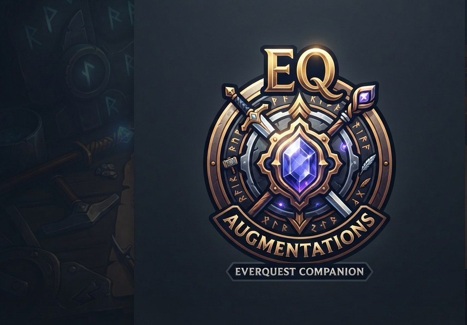
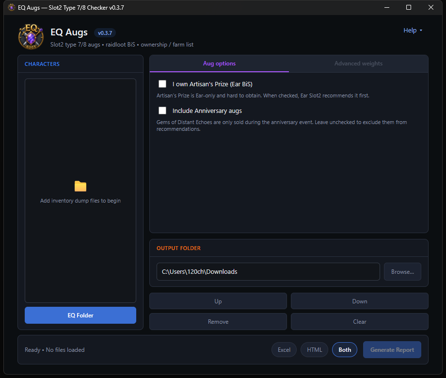

# EQ Augs

<p align="center">
  
</p>

Figure out which Slot2 type 7/8 augs you’re missing — and which ones you already own.

EQ Augs reads your EverQuest inventory dumps, compares equipped type 7/8 augs against live [raidloot.com](https://www.raidloot.com) rankings, and builds a report of upgrades, bag/bank ownership, and a **Need to farm** list. Charm, Range, and Feet (for high-AC classes) get special attention so priority holes show up first.

**Version:** 0.3.7  
**Current build:** [EQAugs-0.3.7.exe](https://github.com/Neclub/EQ-Augs/releases/latest/download/EQAugs-0.3.7.exe)
([all releases](https://github.com/Neclub/EQ-Augs/releases/latest))



## How to use it

1. **Download** the current build above and run `EQAugs-0.3.7.exe` (no install needed).
2. Click **EQ Folder** and choose the folder with your `*-Inventory.txt` dumps (or drop the files into the Characters list).
3. Optionally set **Aug options** — Artisan’s Prize ownership, anniversary gems, etc.
4. Pick an **Output folder** and format (Excel, HTML, or both).
5. Click **Generate Report**.

The report shows what you have equipped vs what’s recommended, marks pieces you already own (bags/bank count), and lists what’s still to farm. Item names link to EQ Resource. For craftable group augs (Unraveling Order, Phantasmal Luclinite, Perpetual Reverie, Uprising, Luclinite Ensanguined), **Need to farm** also notes when you already have the matching Focus of Fortitude / ore in bags or bank. HTML sections are collapsible; Need to farm and Ranked reference start collapsed. The HTML report header shows a character filter, status legend, short catalog timestamp + app version, and the EQ Augs logo.

### Tips

- Leave **Include Anniversary augs** off unless you want Gems of Distant Echoes in the recommendations.
- Scoring defaults are role-focused: tanks **AC + HDex**, melee/hybrids **HDex**, casters **Spell Damage + HInt**, priests **HWis**.
- **Advanced weights** (single character only) lets you tweak scoring for one generate; leave **Use weight overrides** unchecked to stick with class defaults.

## For developers

```bat
run_gui.bat
py -m pip install -e ".[dev]"
py -m pytest
py scripts/prepare_app_icon.py
py scripts/prepare_report_logo.py
build_exe.bat
py scripts/print_weights_doc.py
```

Local build output: `dist\EQAugs-0.3.7.exe`

App / window icons come from `Icon/Icon.png` → `src/eq_augs/assets/eq-icon.{png,ico}`.  
HTML report header logo comes from `Icon/report-logo-source.png` → `src/eq_augs/assets/eq-report-logo.png`.

Weight tables dump: [docs/Aug_Selection_Weights.txt](docs/Aug_Selection_Weights.txt)  
Merge notes for Inventory Parser: [MERGE_NOTES.md](MERGE_NOTES.md)
